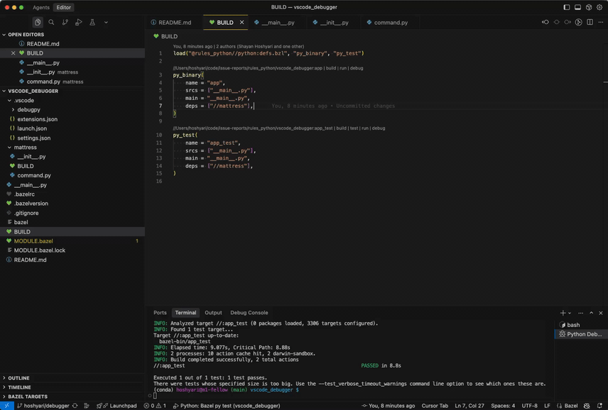
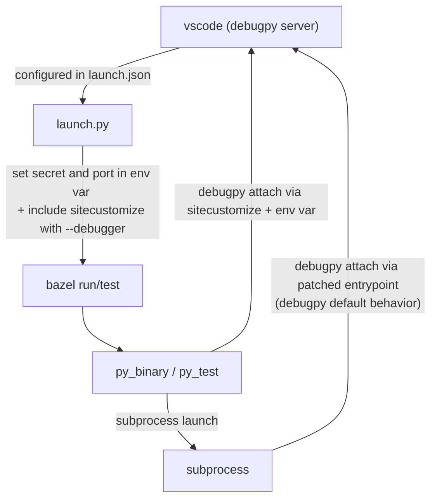

# rules_python + Vcode debugger

## Demo 

- Install vscode recommended extensions: `Cmd + P` -> `Show recommended extensions`
- Select the target `Bazel: run py run` or `Bazel: test py test` in vscode. Only a python interpreter is needed so vscode can startup with (system install works).
  - py run: for tests and binaries. No sandboxing. You can type `//:app` or `//:app_test` in the input field.
  - py tests: for tests only. With sandboxing. You can type `//:app_test` in the input field.
- See breakpoints working in both main process (`mattress`) and subprocess (`mattress/command.py`).

## How does it work?

In addition we pass down [PYDEVD_RESOLVE_SYMLINKS](https://github.com/microsoft/debugpy/issues/743#issuecomment-1112580721) to each process to make sure that the debugger hits breakpoints in original source and not the symlinks in bazel output.

In `launch.json` on can further set or unset [IDE_PROJECT_ROOTS](https://github.com/microsoft/debugpy/issues/824#issuecomment-1018518479) in lieu of `justMyCode`.
